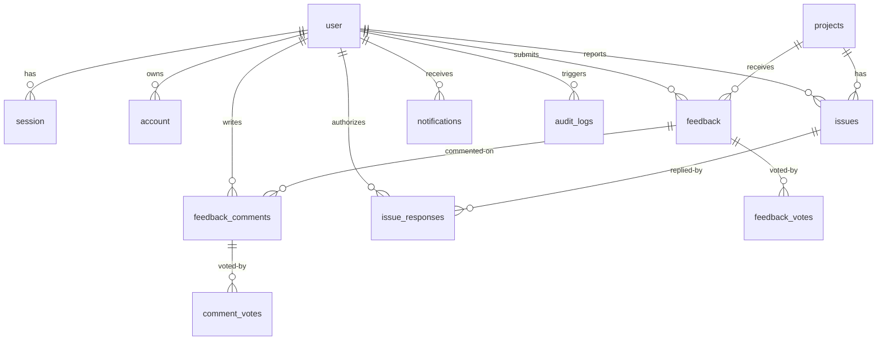

# Database Schema & Data Models

> Relational database schema design for INFRA Watch using PostgreSQL (with PostGIS spatial extensions) and Drizzle ORM.

---

## 1. Schema Overview

INFRA Watch uses a PostgreSQL database with the `postgis` extension enabled to support geospatial queries (e.g., finding infrastructure projects near a citizen's coordinates, mapping projects in specific regions/municipalities). 

Drizzle ORM serves as the type-safe query builder, with the schema split into core business domain entities (`lib/db/schema.ts`) and authentication entities (`auth-schema.ts`).

---

## 2. Table Definitions

### 2.1 Authentication & User Management (`auth-schema.ts`)

These tables are managed in integration with Better Auth for session-based user authentication.

#### `user`
Represents citizens, moderators, admins, and super admins.
- `id` (text, PK)
- `name` (text, NOT NULL)
- `email` (text, NOT NULL, UNIQUE)
- `email_verified` (boolean, default false)
- `image` (text, nullable)
- `role` (text, default 'citizen') — `'super_admin' | 'admin' | 'moderator' | 'citizen'`
- `banned` (boolean, default false)
- `ban_reason` (text, nullable)
- `ban_expires` (timestamp, nullable)
- `phone_number` (text, UNIQUE, nullable)
- `phone_number_verified` (boolean, default false)
- `assigned_municipality` (text, nullable) — Scoping filter for Moderators
- `assigned_agency` (text, nullable) — Scoping filter for multi-agency support (e.g., `'BAFE'`, `'DPWH'`)
- `created_at` (timestamp, default now())
- `updated_at` (timestamp, default now())

#### `session`
Tracks active user login sessions.
- `id` (text, PK)
- `expires_at` (timestamp, NOT NULL)
- `token` (text, UNIQUE)
- `ip_address` (text, nullable)
- `user_agent` (text, nullable)
- `user_id` (text, FK → `user.id` on delete CASCADE)
- `impersonated_by` (text, nullable)

#### `account`
Manages auth credentials and linked accounts (e.g., OAuth providers or credentials passwords).
- `id` (text, PK)
- `account_id` (text, NOT NULL)
- `provider_id` (text, NOT NULL)
- `user_id` (text, FK → `user.id` on delete CASCADE)
- `access_token` (text, nullable)
- `refresh_token` (text, nullable)
- `password` (text, nullable) — Hashed password for email/password authentication
- `created_at` / `updated_at` (timestamp)

#### `verification`
Stores validation tokens for email verification and password resets.
- `id` (text, PK)
- `identifier` (text, NOT NULL)
- `value` (text, NOT NULL)
- `expires_at` (timestamp, NOT NULL)

---

### 2.2 Core Project Domain (`lib/db/schema.ts`)

#### `projects`
Stores local cache of project records synced from ABEMIS for AMEFIP & INS data (2021-2026).
- `id` (uuid, PK, default random)
- `source_project_id` (text, UNIQUE) — External unique ID from ABEMIS
- `source_agency` (text, NOT NULL) — Owner agency and program code (e.g., `'BAFE-AMEFIP'`, `'BAFE-INS'`), allowing other agencies (e.g., `'DPWH-WATER'`) to add data later
- `name` (text, NOT NULL) — Project title
- `description` (text, nullable)
- `status` (text, NOT NULL) — `'planned' | 'ongoing' | 'completed' | 'suspended'`
- `sector` (text, NOT NULL) — e.g., `'Irrigation'`, `'Machinery'`, `'Equipment'`, `'Facilities'`, `'Local Infrastructures'`
- `subsector` (text, nullable)
- `province` (text, NOT NULL)
- `municipality` (text, NOT NULL)
- `barangay` (text, NOT NULL)
- `latitude` (real, NOT NULL)
- `longitude` (real, NOT NULL)
- `geom` (geometry(Point, 4326), nullable) — PostGIS geometry point for spatial searches
- `budget` (real, NOT NULL) — Allocated budget
- `abc` (real, nullable) — Approved Budget for Contract
- `contractor_name` (text, nullable)
- `physical_progress` (real, default 0) — Progress percentage (0–100%)
- `financial_progress` (real, default 0) — Disbursed budget percentage (0–100%)
- `start_date` (timestamp, nullable)
- `target_completion_date` (timestamp, nullable)
- `actual_completion_date` (timestamp, nullable)
- `calendar_days` (integer, nullable)
- `year_funded` (text, NOT NULL) — `'2021'` through `'2026'`
- `implementing_agency` (text, nullable)
- `funding_source` (text, nullable)
- `psgc_code` (text, NOT NULL) — Philippine Standard Geographic Code (barangay level)
- `metadata` (jsonb, default '{}') — Geotagged images, documents, POW, and procurement records
- `last_synced_at` (timestamp, NOT NULL)
- `created_at` (timestamp, default now())
- `updated_at` (timestamp, default now())

**Indexes**:
- Index on `source_project_id` (Unique)
- Index on `source_agency`
- Index on `status`
- Index on `psgc_code`
- Index on `year_funded`
- Spatial index (GIST) on `geom`

#### `feedback`
Feedback, reviews, and ratings submitted by citizens on projects.
- `id` (uuid, PK)
- `project_id` (uuid, FK → `projects.id` on delete CASCADE)
- `user_id` (text, nullable) — Nullable for anonymous submissions
- `rating` (integer, NOT NULL) — 1 to 5 scale
- `comment` (text, NOT NULL)
- `category` (text, NOT NULL) — `'quality' | 'progress' | 'transparency' | 'general'`
- `media` (jsonb, default '[]') — Array of `{ type: 'image' | 'video', url: string, caption?: string }`
- `is_anonymous` (boolean, default false)
- `status` (text, default 'pending') — `'pending' | 'approved' | 'rejected'`
- `moderated_by` (text, FK → `user.id` on delete SET NULL)
- `moderated_at` (timestamp, nullable)
- `moderation_note` (text, nullable)
- `helpful_count` (integer, default 0)
- `created_at` (timestamp, default now())

#### `feedback_votes`
Tracks helpful/unhelpful votes on feedback entries to prevent double voting.
- `id` (uuid, PK)
- `feedback_id` (uuid, FK → `feedback.id` on delete CASCADE)
- `user_id` (text, FK → `user.id` on delete CASCADE)
- `vote_type` (text, NOT NULL) — `'helpful' | 'unhelpful'`
- *Unique Constraint*: (`user_id`, `feedback_id`)

#### `feedback_comments`
Discussion comments on project feedback threads.
- `id` (uuid, PK)
- `feedback_id` (uuid, FK → `feedback.id` on delete CASCADE)
- `user_id` (text, FK → `user.id` on delete CASCADE)
- `comment` (text, NOT NULL)
- `status` (text, default 'published') — `'published' | 'rejected'`
- `rejected_by` (text, nullable)
- `rejection_reason` (text, nullable)
- `created_at` (timestamp, default now())

#### `issues`
Citizen-reported infrastructure issues (e.g. cracked pavements, broken pipes, construction stoppage).
- `id` (uuid, PK)
- `project_id` (uuid, nullable, FK → `projects.id` on delete SET NULL) — Optional association with a project
- `title` (text, NOT NULL)
- `description` (text, NOT NULL)
- `issue_type` (text, NOT NULL) — `'damage' | 'delay' | 'environmental' | 'safety' | 'other'`
- `province` (text, NOT NULL)
- `municipality` (text, NOT NULL)
- `barangay` (text, NOT NULL)
- `street_landmark` (text, nullable)
- `latitude` (real, NOT NULL)
- `longitude` (real, NOT NULL)
- `geom` (geometry(Point, 4326), nullable)
- `photo_urls` (jsonb, default '[]') — Array of strings
- `status` (text, default 'pending') — `'pending' | 'investigating' | 'resolved' | 'closed'`
- `reporter_id` (text, nullable, FK → `user.id` on delete SET NULL)
- `reporter_name` (text, NOT NULL)
- `reporter_contact` (text, NOT NULL)
- `reporter_email` (text, nullable)
- `is_anonymous` (boolean, default false)
- `resolved_at` (timestamp, nullable)
- `created_at` (timestamp, default now())
- `updated_at` (timestamp, default now())

#### `issue_responses`
Official responses from moderators or implementing agencies regarding reported issues.
- `id` (uuid, PK)
- `issue_id` (uuid, FK → `issues.id` on delete CASCADE)
- `responder_id` (text, FK → `user.id` on delete CASCADE)
- `message` (text, NOT NULL)
- `new_status` (text, nullable) — If the response updates the issue status
- `attachment_urls` (jsonb, default '[]')
- `is_internal_only` (boolean, default false) — For system internal notes
- `created_at` (timestamp, default now())

---

### 2.3 System & Analytics Support Tables

#### `notifications`
- `id` (uuid, PK)
- `user_id` (text, FK → `user.id` on delete CASCADE)
- `type` (text, NOT NULL) — e.g. `'feedback_approved'`, `'issue_response'`, `'system_announcement'`
- `title` (text, NOT NULL)
- `message` (text, NOT NULL)
- `metadata` (jsonb, default '{}') — `{ projectId?: string, feedbackId?: string, issueId?: string }`
- `is_read` (boolean, default false)
- `read_at` (timestamp, nullable)
- `created_at` (timestamp, default now())

#### `sync_logs`
Tracks execution status of background synchronization runs with ABEMIS.
- `id` (uuid, PK)
- `sync_type` (text, NOT NULL) — `'scheduled' | 'manual'`
- `status` (text, NOT NULL) — `'running' | 'completed' | 'failed'`
- `source_agency` (text, NOT NULL) — `'BAFE-AMEFIP' | 'BAFE-INS' | 'ALL' (or other agency codes)`
- `records_processed` (integer, default 0)
- `records_created` (integer, default 0)
- `records_updated` (integer, default 0)
- `errors` (jsonb, nullable)
- `started_at` (timestamp, NOT NULL)
- `completed_at` (timestamp, nullable)

#### `audit_logs`
Tracks modifications of records for accountability.
- `id` (uuid, PK)
- `table_name` (text, NOT NULL)
- `record_id` (text, NOT NULL)
- `action` (text, NOT NULL) — `'CREATE' | 'UPDATE' | 'DELETE'`
- `user_id` (text, nullable, FK → `user.id` on delete SET NULL)
- `old_values` (jsonb, nullable)
- `new_values` (jsonb, nullable)
- `ip_address` (text, nullable)
- `created_at` (timestamp, default now())

#### `regional_statistics`
Aggregated tables for fast analytics rendering.
- `id` (uuid, PK)
- `year` (text, NOT NULL) — `'2021'` through `'2026'`, or `'OVERALL'`
- `region` (text, NOT NULL)
- `source_agency` (text, NOT NULL) — e.g., `'BAFE-AMEFIP' | 'BAFE-INS' (supports other agency codes)`
- `budget_allocated` (real, default 0)
- `total_projects` (integer, default 0)
- `completed_projects` (integer, default 0)
- `ongoing_projects` (integer, default 0)
- `planned_projects` (integer, default 0)
- `suspended_projects` (integer, default 0)
- `updated_at` (timestamp, default now())

---

## 3. Relationships Diagram

